<!-- ============================================================= -->
<!--                  ASHIRBAD PATTNAIK                             -->
<!--         Software Engineer • AI Engineer                        -->
<!-- ============================================================= -->

<div align="center">



<br>


<br><br>

<h3>

💜 Software Engineer • 🤖 AI Engineer • 🌐 Full Stack Developer

</h3>

<p>

Building scalable software powered by Artificial Intelligence,
Backend Engineering, Cloud Computing and Modern Software Development.

</p>

<br>

<a href="./Ashirbad_Pattnaik_Resume.pdf">


</a>

<a href="https://ash-tech.lovable.app">


</a>

<a href="https://www.linkedin.com/in/ashirbad003/">


</a>

<a href="mailto:pattnaikashirbad4@gmail.com">


</a>

<br><br>


</div>

---

# 👋 Welcome

Hi, I'm **Ashirbad Pattnaik**, a final-year Computer Science & Technology undergraduate at **NIST University** with a strong interest in **Artificial Intelligence, Software Engineering, Backend Development, Cloud Computing, and Full Stack Development**.

I enjoy transforming ideas into practical software solutions that are scalable, maintainable, and user-focused.

This GitHub profile serves as my engineering portfolio, showcasing my projects, technical skills, certifications, internship experience, and continuous learning journey.

Whether you're a recruiter, engineer, collaborator, or fellow developer, I hope this profile gives you a clear picture of how I approach software engineering.

---

# 🚀 Quick Snapshot

```yaml
Name:
  Ashirbad Pattnaik

Location:
  Odisha, India

Education:
  B.Tech
  Computer Science & Technology
  NIST University

Open To:
  • Software Engineer
  • AI Engineer
  • Backend Developer
  • Full Stack Developer

Interests:
  • Artificial Intelligence
  • Machine Learning
  • Backend Engineering
  • Cloud Computing
  • Software Engineering
```

---

# 💜 Professional Philosophy

> **"The best software doesn't just solve problems. It creates meaningful impact."**

I believe software engineering is about understanding problems, designing reliable systems, writing clean code, and continuously improving through practical experience.

Every project I build is another opportunity to learn, innovate, and create software that makes a difference.

---

<div align="center">

### ⚡ Turning Ideas into Intelligent Software

</div>

---

# 🧭 Navigation

| Section | Description |
|:---------|:------------|
| 👨 About | Professional Overview |
| 💻 Technical Skills | Technologies & Tools |
| 💼 Experience | Internships & Training |
| 🚀 Projects | Featured Engineering Work |
| 🏆 Certifications | Professional Learning |
| 📊 GitHub | Statistics & Contributions |
| 🌱 Current Focus | Learning Journey |
| 📬 Contact | Connect With Me |

---

<div align="center">


</div>

<!-- ============================================================= -->
<!--               TECHNICAL EXPERTISE & EXPERIENCE                 -->
<!-- ============================================================= -->

#  Technical Expertise

> **"Strong engineering is built on strong fundamentals, practical experience, and continuous learning."**

I enjoy building modern software solutions that combine clean architecture, scalable backend systems, Artificial Intelligence, and intuitive user experiences.

My experience comes from academic learning, internships, certifications, hackathons, and building real-world applications.

---

<div align="center">

# 💜 Technology Stack


</div>

---

# 🚀 Core Expertise

<table>

<tr>

<td width="50%">

## 💻 Programming

- Python
- Java
- JavaScript
- C
- C++
- SQL

---

## 🌐 Frontend

- HTML5
- CSS3
- React
- React Native
- Flutter
- Tailwind CSS

---

## ⚙ Backend

- FastAPI
- Node.js
- Express.js
- REST APIs
- Authentication
- API Development

</td>

<td width="50%">

## 🤖 Artificial Intelligence

- Machine Learning
- Generative AI
- NLP
- Prompt Engineering
- AI Applications

---

## ☁ Cloud & DevOps

- AWS
- Git
- GitHub
- Linux

---

## 🗄 Databases

- MySQL
- SQLite
- PostgreSQL
- Neo4j

</td>

</tr>

</table>

---

# 📈 Technical Strengths

<div align="center">

| Domain | Focus |
|:--|:--|
| 🤖 Artificial Intelligence | Machine Learning • NLP • LLM Applications |
| ⚙ Backend Engineering | FastAPI • REST APIs • Authentication |
| 🌐 Full Stack Development | React • Flutter • Node.js |
| ☁ Cloud Computing | AWS • Deployment |
| 🗄 Database Systems | MySQL • SQLite • PostgreSQL |
| 💻 Software Engineering | OOP • DSA • DBMS • OS |

</div>

---

# 💼 Professional Experience

## 🏭 IT & ERP Intern

### RINL – Visakhapatnam Steel Plant

📅 **May 2026 – June 2026**

Worked on enterprise software solutions, ERP workflows, and industrial software systems.

### Key Contributions

- Enterprise Software Development
- ERP Workflow Automation
- Business Process Optimization
- Authentication Systems
- Database Integration

**Tech Stack**

`Java` `J2EE` `ERP` `SQL` `Software Engineering`

---

## 📊 Data Science & Analytics Intern

### NIST University

📅 **May 2025 – June 2025**

Worked on Python-based analytics, preprocessing, visualization, and real-world datasets.

### Key Contributions

- Data Cleaning
- Exploratory Data Analysis
- Statistical Analysis
- Python Automation
- Data Visualization

**Tech Stack**

`Python` `Pandas` `NumPy` `Matplotlib`

---

## 💻 Advanced Programming & Competitive Coding

### NIST University

📅 **July 2024 – August 2024**

Focused on strengthening algorithmic thinking and problem-solving through intensive programming practice.

### Skills Developed

- Data Structures
- Algorithms
- Recursion
- Graphs
- Trees
- Dynamic Programming
- Code Optimization

---

# 🎓 Education

| Qualification | Institution |
|:--|:--|
| 🎓 Bachelor of Technology (Computer Science & Technology) | NIST University |
| 📘 Higher Secondary (Science) | Saraswati Vidya Mandir Higher Secondary School |
| 📗 Secondary Education | Saraswati Sishu Vidya Mandir |

---

# 🏅 Professional Certifications

<div align="center">

| Category | Certifications |
|:--|:--|
| 🤖 Artificial Intelligence | AI Engineer • AI & Data Scientist |
| 💻 Software Engineering | Electronic Arts Software Engineering Job Simulation |
| ☁ Cloud Computing | AWS Solutions Architecture Job Simulation |
| 📊 Data Analytics | Deloitte • Tata GenAI Simulations |
| 🗄 Database | Neo4j Certified Professional |
| ☕ Programming | Java Professional Certification |

</div>

---

# 🥇 Achievements

- 🥇 Matric Super Topper
- 🏅 UTSE Merit Certificate
- 🏅 Bajaj Capital Certificate of Appreciation
- 🚀 Trithon Hackathon Participant
- 💼 Brand Executive – LaunchEd Global

---

# 🌱 Currently Learning

```yaml
Artificial Intelligence:
  - Large Language Models
  - AI Agents
  - Retrieval-Augmented Generation (RAG)

Software Engineering:
  - System Design
  - Backend Architecture
  - Design Patterns

Cloud:
  - AWS Services
  - Cloud Deployment

Development:
  - Production Ready Applications
  - Scalable Software Architecture
```

---

<div align="center">

## 💜 "Keep Learning. Keep Building. Keep Improving."


</div>


<!-- ============================================================= -->
<!--                 FEATURED ENGINEERING PROJECTS                  -->
<!-- ============================================================= -->

#  Featured Engineering Projects

> **Real-world projects that showcase my expertise in Artificial Intelligence, Software Engineering, Backend Development, Mobile Applications, and Enterprise Systems.**

<br>

<div align="center">

| 🌸 FemCare AI | 📄 ATS Resume Checker |
|---------------|----------------------|
| AI Healthcare Platform | AI Resume Analysis |

| 📱 INTERACT | 🏭 RINL ERP |
|-------------|-------------|
| Social Media Platform | Enterprise Software |

</div>

---

# 🌸 FemCare AI


### 📝 Overview

AI-powered healthcare platform focused on women's wellness with intelligent cycle prediction, symptom tracking, personalized insights, and secure healthcare management.

---

### 🚀 Key Features

- 🤖 AI Healthcare Assistant
- 📅 Cycle Prediction
- ❤️ Health Insights
- 📊 Dashboard
- 🔐 Secure Authentication
- ☁ Cloud Ready

---

### 🏗 Architecture

```text
Flutter App
      │
      ▼
 FastAPI Backend
      │
      ▼
 AI Engine
      │
      ▼
 Database
```

---

### ⚙ Tech Stack

<div align="center">


</div>

---

### 🎯 Engineering Focus

- Clean Architecture
- REST APIs
- AI Integration
- Authentication
- Scalable Backend

---

<br>

# 📄 ATS Resume Checker


### 📝 Overview

An AI-powered ATS Resume Analyzer that evaluates resumes, extracts technical skills, analyzes job compatibility, and provides intelligent recommendations using NLP and Large Language Models.

---

### 🚀 Key Features

- Resume Parsing
- ATS Score
- AI Suggestions
- Skill Extraction
- Keyword Analysis
- Recruiter Insights

---

### ⚙ Tech Stack

<div align="center">


</div>

**AI Technologies**

- NLP
- Prompt Engineering
- LLM Applications

---

### 🎯 Engineering Focus

- AI Workflow
- Document Processing
- Resume Intelligence

---

<br>

# 📱 INTERACT


### 📝 Overview

A next-generation social networking platform combining AI-powered discovery, cloud infrastructure, messaging, communities, and cross-platform support.

---

### 🚀 Key Features

- AI Search
- Messaging
- Communities
- Notifications
- Cloud Integration
- Cross Platform

---

### ⚙ Tech Stack

<div align="center">


</div>

---

### 🎯 Engineering Focus

- Full Stack Development
- Cloud Architecture
- Performance Optimization

---

<br>

# 🏭 RINL Material Gate Pass System


### 📝 Overview

Enterprise web application developed during internship to automate industrial gate pass workflows, approvals, authentication, and reporting.

---

### 🚀 Key Features

- Material Tracking
- Approval Workflow
- Authentication
- Reporting
- Dashboard
- Secure Database

---

### ⚙ Tech Stack

<div align="center">


</div>

---

### 🎯 Engineering Focus

- Enterprise Software
- Business Automation
- Database Design

---

# 💡 Engineering Practices Used Across Projects

<div align="center">

| Principle | Applied In |
|:-----------|:-----------|
| 🏛 Clean Architecture | Modular project structure |
| 🔒 Security | Authentication & API protection |
| ☁ Cloud Ready | Scalable deployment approach |
| ⚡ Performance | Optimized application design |
| 📚 Documentation | Well-structured READMEs |
| 🧪 Testing | Feature validation & debugging |

</div>

---

<div align="center">

### 🚀 Every project reflects my commitment to building scalable, reliable, and user-focused software.


</div>


<!-- ============================================================= -->
<!--                GITHUB DASHBOARD & ANALYTICS                    -->
<!-- ============================================================= -->

#  GitHub Dashboard

> **"Consistency, collaboration, and continuous learning define every contribution."**

This GitHub profile represents my learning journey through software engineering, Artificial Intelligence, open-source exploration, and real-world application development.

---

<div align="center">

## 📊 GitHub Statistics


</div>

---

## 🔥 Contribution Streak


</div>

---

<div align="center">

## 📈 Contribution Graph


</div>

---

<div align="center">

## 🏆 GitHub Trophies


</div>

---

<div align="center">

## 🐍 Contribution Snake

<picture>

<source media="(prefers-color-scheme: dark)" srcset="https://raw.githubusercontent.com/ashirbad003/ashirbad003/output/github-contribution-grid-snake-dark.svg"/>

<source media="(prefers-color-scheme: light)" srcset="https://raw.githubusercontent.com/ashirbad003/ashirbad003/output/github-contribution-grid-snake.svg"/>


</picture>

</div>

---

<div align="center">

## 📊 Developer Metrics


<br><br>


<br><br>


</div>

<p align="center">

</p>

## 📊 Developer Metrics


<br><br>


<br><br>


</div>

---
## 🏆 GitHub Trophies

<p align="center">

</p>

<p align="center">

</p>


# 🚀 Current Focus

<div align="center">

| 🔥 Building | 📚 Learning | 🎯 Exploring |
|:-----------|:-----------|:-------------|
| AI Applications | System Design | AI Agents |
| Backend APIs | AWS Cloud | Large Language Models |
| Enterprise Software | Scalable Architecture | Cloud Native Systems |
| Full Stack Apps | Clean Architecture | DevOps |

</div>

---

# 💡 Development Philosophy

I believe GitHub is more than a place to store code.

It reflects consistency, collaboration, and continuous improvement.

Every repository, commit, and project represents another step in my journey toward becoming a better Software Engineer.

---

<div align="center">

### 💜 *Build Consistently • Learn Continuously • Engineer with Purpose*


</div>


<!-- ============================================================= -->
<!--           ENGINEERING PRINCIPLES & DEVELOPMENT                 -->
<!-- ============================================================= -->

#  Engineering Principles

> **Building reliable software through thoughtful design, clean architecture, and continuous improvement.**

Software engineering is more than writing code. My focus is on creating solutions that are scalable, maintainable, secure, and user-centric.

---

## 🏛 Software Engineering Approach

<div align="center">

| Principle | My Approach |
|:---------|:------------|
| 🧩 Clean Architecture | Modular, reusable and maintainable code |
| ⚡ Performance | Optimized for speed and efficiency |
| 🔒 Security | Authentication, validation & secure APIs |
| 📚 Documentation | Clear, structured and developer-friendly |
| ☁ Scalability | Cloud-ready and future-proof solutions |
| 🧪 Testing | Validate features before deployment |
| 🔄 Continuous Improvement | Learn, iterate and improve |

</div>

---

# 🚀 Development Workflow

<div align="center">

```text
💡 Idea
   │
   ▼
📑 Research
   │
   ▼
📝 Planning
   │
   ▼
🏗 System Design
   │
   ▼
💻 Development
   │
   ▼
🧪 Testing
   │
   ▼
🚀 Deployment
   │
   ▼
📈 Monitoring
   │
   ▼
🔄 Continuous Improvement
```

</div>

---

# 🏗 Typical Project Architecture

```text
                Client

                  │

                  ▼

         Frontend Application

                  │

                  ▼

             REST API Layer

                  │

                  ▼

          Business Logic Layer

                  │

                  ▼

            Database Layer

                  │

                  ▼

          Cloud Infrastructure
```

---

# 📂 Standard Project Structure

```text
Project/
│
├── assets/
├── docs/
├── screenshots/
├── src/
│   ├── components/
│   ├── pages/
│   ├── services/
│   ├── utils/
│   ├── models/
│   └── config/
│
├── tests/
├── README.md
├── LICENSE
├── CHANGELOG.md
├── CONTRIBUTING.md
└── .github/
```

---

# 🔒 Security Practices

I follow secure development practices whenever applicable:

- 🔐 Environment Variables
- 🔑 JWT Authentication
- 🛡 Input Validation
- 🚫 Proper Error Handling
- 🔒 Password Hashing
- 📡 Secure API Communication
- 🗄 Database Protection
- 🔍 Principle of Least Privilege

---

# 🧪 Quality Checklist

Before considering a project complete, I aim to ensure:

- ✅ Clean Folder Structure
- ✅ Consistent Code Formatting
- ✅ Responsive User Interface
- ✅ API Documentation
- ✅ Secure Authentication
- ✅ Error Handling
- ✅ Performance Optimization
- ✅ Production-Ready Architecture

---

# 📈 Continuous Learning Cycle

<div align="center">

```text
📚 Learn
      │
      ▼
🧠 Understand
      │
      ▼
💻 Build
      │
      ▼
🐞 Debug
      │
      ▼
🚀 Deploy
      │
      ▼
📊 Improve
      │
      ▼
🔁 Repeat
```

</div>

---

# 💼 Engineering Mindset

I enjoy solving problems by first understanding **why** they exist before deciding **how** to solve them.

Rather than focusing only on implementation, I prioritize architecture, maintainability, readability, and long-term scalability.

My goal is to build software that not only works today but remains reliable and easy to evolve in the future.

---

<div align="center">

### 💜 Engineering is about building systems that people can trust.


</div>


<!-- ============================================================= -->
<!--                  LET'S CONNECT & FINAL                         -->
<!-- ============================================================= -->

#  Let's Connect

> **"The best software is built through collaboration, curiosity, and continuous learning."**

If you're interested in discussing software engineering, Artificial Intelligence, open-source collaboration, internships, or full-time opportunities, I'd be happy to connect.

---

<div align="center">

# 🤝 Professional Links

<a href="./Ashirbad_Pattnaik_Resume.pdf">


</a>

<a href="https://ash-tech.lovable.app">


</a>

<a href="https://www.linkedin.com/in/ashirbad003/">


</a>

<a href="mailto:pattnaikashirbad4@gmail.com">


</a>

<a href="https://github.com/ashirbad003">


</a>

</div>

---

# 💼 Open To Opportunities

<div align="center">

| Position | Status |
|:---------|:------:|
| 💻 Software Engineer | 🟢 Open |
| 🤖 AI Engineer | 🟢 Open |
| ⚙ Backend Developer | 🟢 Open |
| 🌐 Full Stack Developer | 🟢 Open |
| ☁ Cloud Engineer | 🟢 Open |

</div>

---

# 🌍 Collaboration Interests

I'm always interested in collaborating on projects related to:

- 🤖 Artificial Intelligence
- ⚙ Backend Engineering
- 🌐 Full Stack Development
- 📱 Mobile Applications
- ☁ Cloud Computing
- 🚀 Open Source Projects

Whether it's discussing ideas, building software, contributing to open source, or exploring new technologies, I'm always happy to connect with fellow developers and professionals.

---
## 📈 Activity Graph

<p align="center">

</p>

<p align="center">

</p>


# 📬 Contact Information

```yaml
Name:
  Ashirbad Pattnaik

Location:
  Odisha, India

Email:
  pattnaikashirbad4@gmail.com

LinkedIn:
  linkedin.com/in/ashirbad003

Portfolio:
  ash-tech.lovable.app

GitHub:
  github.com/ashirbad003
```

---

<div align="center">

## 💜 Thanks for Visiting

### Building intelligent software through innovation, curiosity, and continuous learning.

<br>



<br>

### ⭐ If you enjoyed exploring my work, feel free to connect or explore my repositories.

<br>

**Ashirbad Pattnaik**

*Software Engineer • AI Engineer • Full Stack Developer*

</div>


## 💭 Quote

> *"Great software is not built by writing more code. It's built by solving the right problems with clean engineering."*

<p align="center">

</p>
